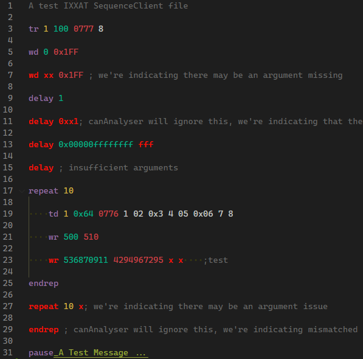

# Syntax Highlight for IXXAT canAnalyser SequenceClient files

- VSCode Extension for language grammar support
- .PRF files
- Known compatible with IXXAT's canAnalyser/32 V1.81 and canAnalyser3 V3.3
- Highlight includes indicating potential commands with bad arguments or mismatched closures.
  - See [test.prf](test.prf) for examples.

Excerpt from `test.prf`:  

